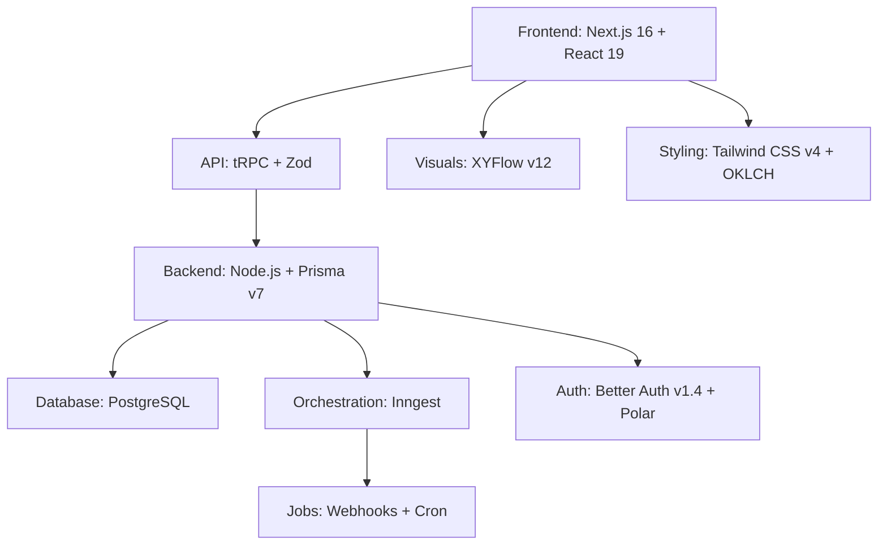

<div align="center">
  
  <h1>NodeWeave</h1>
  <p><strong>A high-fidelity, node-based workflow automation platform.</strong></p>

  <p>
    
    
    
    
    
    
    
  </p>

  <p>
    <a href="#getting-started">Getting Started</a> •
    <a href="#core-features">Features</a> •
    <a href="#supported-integrations">Integrations</a> •
    <a href="#technology-stack">Tech Stack</a> •
    <a href="#api-routes">API</a> •
    <a href="#contributing">Contributing</a>
  </p>
</div>

<br />

---

## 🌟 Overview

**NodeWeave** is a modern SaaS automation platform that follows a premium **"Muted Sage & Obsidian"** aesthetic. It allows users to build sophisticated workflows by connecting various triggers and actions through a high-fidelity visual node-based editor powered by **XYFlow v12**. 

The platform emphasizes professional dark mode consistency, glassmorphism, and pixel-perfect status tracking, backed by the reliability of **Inngest** for background job processing.

---

## 🚀 Core Features

### 🎨 Visual Workflow Editor
- **Drag-and-Drop Interface**: Built on **XYFlow v12** for smooth, real-time workflow visualization.
- **Muted Sage & Obsidian Theme**: Professional dark mode with glassmorphic toolbars and high-contrast status colors (Emerald, Blue, Amber, Red).
- **One-Click Template Publishing (Admin)**: Instantly turn any live workflow into a reusable community template with automatic credential stripping for maximum security.
- **Interactive Template Showcase**: Preview full workflow logic and branching handles in a live viewer before applying to your canvas.
- **Context-Rich Editor Templates**: A fully integrated template gallery inside the editor with names, descriptions, and usage tracking.

### ⚡ Workflow Execution Engine
- **Reliable background job processing**: Powered by **Inngest** with event-driven architecture.
- **Real-Time Updates**: Live execution status tracking with adaptive polling for optimal performance.
- **Execution History Replay**: Re-run failed webhooks or manual triggers with original payloads for instant recovery.
- **Conditional Branching**: Visual branching logic with dedicated true/false paths for complex scenarios.
- **Scheduled Execution**: Native support for cron-based workflow scheduling.
- **Usage Metering & Quotas**: Built-in monthly execution tracking and active-workflow capping for SaaS tiers.

### 🔐 Authentication & User Management
- **Better Auth v1.4+**: Secure authentication with specialized **Polar** integration for subscriptions.
- **Stable Social Sign-in**: Optimized Google/GitHub flows with robust redirection (vetted for Zen/Firefox).
- **Credential Encryption**: Secure storage for OpenAI, Anthropic, Gemini, and GitHub tokens using **Cryptr**.

---

## 🔗 Supported Integrations

### 🚦 Triggers
- **Manual Trigger**: Start workflows manually from the dashboard.
- **Email Trigger**: Process incoming emails via Resend, SendGrid, Mailgun, or Postmark.
- **GitHub Trigger**: Respond to repo events (issues, PRs, comments).
- **Telegram & WhatsApp**: Trigger workflows from incoming chat messages.
- **Google Form**: Automatic processing of form submissions.
- **Stripe**: Handle payment events and subscription lifecycle.
- **Webhook**: Generic HTTP POST receiver for external third-party data.
- **Cron**: Time-based triggers (Every minute, Hourly, Daily, etc.).

### ⚙️ Action Nodes
- **AI Models**: Full support for OpenAI, Anthropic Claude, and Google Gemini.
- **Messaging**: Discord, Slack, Telegram, WhatsApp (Twilio), and Email (SMTP/Resend).
- **Developer Tools**: GitHub issue management and repo coordination.
- **HTTP Request**: Custom REST API calls with support for all methods and headers.

### 🧠 Logic Nodes
- **If/Else Condition**: High-fidelity visual branching for conditional paths.
- **Data Transformer**: Reshape nested data structures using Handlebars templates.
- **Custom Code (JS)**: Sandboxed JavaScript (QuickJS) with **Variable Name Isolation**.
- **Delay / Wait**: Pause execution for granular durations (seconds to days).

---

## 🛠️ Technology Stack



---

## 🏗️ Project Structure

```text
nodeweave/
├── prisma/                    # Database schema & migrations
├── public/                    # Logos and static assets
├── src/
│   ├── app/                   # Next.js App Router & Layouts
│   │   ├── features/          # Feature-specific logic & UI
│   │   │   ├── auth/          # Authentication & sessions
│   │   │   ├── editor/        # XYFlow Canvas & Nodes
│   │   │   ├── executions/    # Execution state & history
│   │   │   ├── triggers/      # Webhook & Cron triggers
│   │   │   └── templates/     # Gallery & metadata
│   ├── components/            # Atomic UI components (Shadcn)
│   ├── hooks/                 # Business logic hooks
│   ├── inngest/               # Background task definitions
│   ├── lib/                   # Auth, DB, and Encryption utilities
│   └── trpc/                  # Type-safe API procedures
```

---

## 🚥 Getting Started

### Prerequisites
- Node.js 18+
- PostgreSQL Database
- npm or pnpm

### Quick Setup

1. **Clone and Install**
   ```bash
   git clone https://github.com/Bharat940/nodeweave.git
   cd nodeweave
   npm install
   ```

2. **Database Migration**
   ```bash
   npx prisma generate
   npx prisma db push
   ```

3. **Multi-Service Development**
   ```bash
   npm run dev:all # Starts Next.js + Inngest + Tunneling
   ```

The dashboard will be live at `http://localhost:3000`.

---

## 🛡️ Security & API

### Encryption
All credentials (API Keys, OAuth Tokens) are encrypted at rest using **Cryptr**. NodeWeave never stores sensitive keys in plain text.

### Verification
Inbound webhooks are verified via signature checking, and the platform implements full **CSRF protection** and **Password Hashing** via Better Auth.

---

## 📄 Scripts & Commands

- `npm run dev`: Next.js development server.
- `npm run inngest:dev`: Inngest orchestration server.
- `npm run build`: Production bundle generation.
- `npm run lint`: Code quality enforcement.

---

<p align="center">
  Distributed under the MIT License. Built with ❤️ by 
  <strong>Bharat Dangi</strong> 
  (<a href="mailto:bdangi450@gmail.com">bdangi450@gmail.com</a>).
</p>